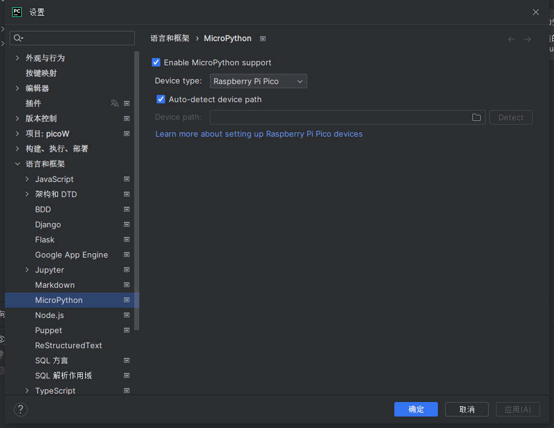
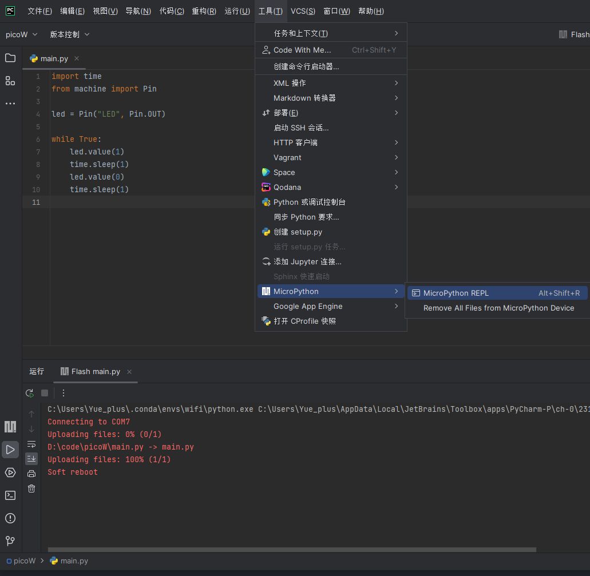

# 使用 RaspberryPi Pico W

## 配置 PyCharm 开发环境

下载安装 [MicroPython](https://plugins.jetbrains.com/plugin/9777-micropython) 插件。
安装完成后 **重启一下 PyCharm**。



可能需要安装以下软件包：

```text
pyserial>=3.5,4.0
docopt>=0.6.2,0.7
adafruit-ampy>=1.0.5,1.1
```



## 连接 WiFi

```python
import time
import network

wlan = network.WLAN(network.STA_IF)
wlan.active(True)
wlan.connect('TP-LINK_25A3', 'cocacola@1')

# Wait for connect or fail
max_wait = 10
while max_wait > 0:
    if wlan.status() < 0 or wlan.status() >= 3:
        break
    max_wait -= 1
    print('waiting for connection...')
    time.sleep(1)

# Handle connection error
if wlan.status() != 3:
    raise RuntimeError('network connection failed')
else:
    print('connected')
    status = wlan.ifconfig()
    print('ip = ' + status[0])
```

## HTTP　请求

参考：[`urequests` — Network Request Module](https://makeblock-micropython-api.readthedocs.io/en/latest/public_library/Third-party-libraries/urequests.html)

```python
import codey
import urequests as requests
import ujson

# user_account and password is mblock's account and password
def get_user_request_header():
    post_data = ujson.dumps({ 'account': 'user_account', 'password': 'password'})
    request_url = 'http://passport2.makeblock.com/v1/user/login'
    res = requests.post(request_url, headers = {'content-type': 'application/json'}, data = post_data).json()
    header_data = ''
    if res['code'] == 0:
        header_data = { "content-type": 'application/json; charset=utf-8', "devicetype": '1'}
        header_data["uid"] = str(res['data']['user']['uid'])
        header_data["deviceid"] = '30AEA427EC60'
    return header_data

# Get weather information
# cid: checkpoint id
# arg: Information to be queried
#            aqi:  Air Quality Index
#            pm25: PM2.5 concentration
#            pm10: PM10 concentration
#            co:   Carbon monoxide concentration
#            so2:  Sulfur dioxide concentration
#            no2:  Nitrogen dioxide concentration
def get_air_quality_info(cid, arg):
    if not codey.wifi.is_connected():
        return ''
    post_data = ujson.dumps({ "cid": cid, "arg": arg})
    request_url = 'http://msapi.passport3.makeblock.com/' + 'air/getone'
    res = requests.post(request_url, headers = get_user_request_header(), data = post_data)
    text = res.text
    return float(text)

# Fill in your router's ssid and password here.
codey.wifi.start('wifi_ssid', 'password')
codey.led.show(0,0,0)
while True:
    if codey.wifi.is_connected():
        codey.led.show(0,0,255)
        data = get_air_quality_info('1539','aqi')  #1539 is Shenzhen checkpoint id
        codey.display.show(data)
    else:
        codey.led.show(0,0,0)
```