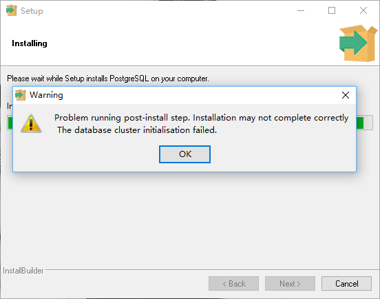

# PostgreSQL

:::info
PostgreSQL：世界上最先进的开源关系型数据库

[官方网站](https://www.postgresql.org/)
| [官方文档](https://www.postgresql.org/docs/)
:::

## 链接

- [PostgreSQL 教程 | 菜鸟教程](https://www.runoob.com/postgresql/postgresql-tutorial.html)
- [PostgreSQL新手入门 - 阮一峰的网络日志](https://www.ruanyifeng.com/blog/2013/12/getting_started_with_postgresql.html)

## 安装

### Ubuntu

```shell
# 创建文件仓库配置：
sudo sh -c 'echo "deb http://apt.postgresql.org/pub/repos/apt $(lsb_release -cs)-pgdg main" > /etc/apt/sources.list.d/pgdg.list'

# 导入仓库签名密钥
wget --quiet -O - https://www.postgresql.org/media/keys/ACCC4CF8.asc | sudo apt-key add -

# 更新软件包列表
sudo apt-get update

# 安装最新版本的 PostgreSQL。
# 如果想要安装特定版本，请使用 `postgresql-12` 或类似：
sudo apt-get -y install postgresql
```

> 参考 [PostgreSQL: Linux downloads (Ubuntu)](https://www.postgresql.org/download/linux/ubuntu/)

安装完毕后，系统会创建一个数据库超级用户 `postgres`，密码为空。

```bash
# 切换用户
postgres@VM-0-5-ubuntu:~$ sudo -i -u postgres

# 打开数据库终端
postgres@VM-0-5-ubuntu:~$ psql
psql (14.1 (Ubuntu 14.1-2.pgdg20.04+1))
Type "help" for help.

postgres=#

# 退出数据库终端
postgres=# \q
```

### Windows

参考 [PostgreSQL: Windows installers](https://www.postgresql.org/download/windows/) 获取下载链接：

[exe 安装包](https://www.enterprisedb.com/downloads/postgres-postgresql-downloads)
[zip 压缩包](https://www.enterprisedb.com/download-postgresql-binaries)

::: warning
安装时 **不要** 选中文，否则安装失败！
（没有 PostgreSQL 14 的 Server 显示；计算机管理->服务和应用程序->服务中 也没有 postgresql-x64-11 这个服务 ）


:::

### Docker

参考：[postgres - Official Image | Docker Hub](https://hub.docker.com/_/postgres)

```sh
# 拉取镜像
docker pull postgres

# 运行镜像
docker run --name some-postgres -e POSTGRES_PASSWORD=mysecretpassword -d postgres

# 随 Doker 自启动容器
docker update --restart=always some-postgres
```

```text
jdbc:postgresql://localhost:5432/postgres
```

## 配置

### 设置密码

```postgresql
postgres=# \password postgres
Enter new password:
Enter it again:
```

### 创建用户和数据并赋予权限

```sql
-- 创建用户
CREATE USER yueplus WITH PASSWORD 'password';

-- 创建数据库
CREATE DATABASE yuedb OWNER yueplus;

-- 赋予所有权限
GRANT ALL PRIVILEGES ON DATABASE yuedb TO yueplus;
```

也可在 shell 中创建超级用户：

```sh
postgres createuser --superuser yueplus
```

### Ubuntu 配置 PostgreSQL

#### 设置数据允许远程连接

编辑配置文件 `/etc/postgresql/14/main/postgresql.conf` 第 60 行：

```diff
-60 listen_addresses = 'localhost'          # what IP address(es) to listen on;
+60 listen_addresses = '*'                  # what IP address(es) to listen on;
 61                                         # comma-separated list of addresses;
 62                                         # defaults to 'localhost'; use '*' for all
```

#### 设置允许账户远程登入

编辑配置文件 `/etc/postgresql/14/main/pg_hba.conf`：

```conf
# TYPE  DATABASE  USER  ADDRESS    METHOD

# 允许所有用户从任何 IP 登入使用任何数据库
host    all       all   0.0.0.0/0  scram-sha-256
```

> 参考：
> - [PostgreSQL: Documentation: 14: 21.1. The pg_hba.conf File](https://www.postgresql.org/docs/14/auth-pg-hba-conf.html)
> - [PostgreSQL的pg_hba.conf文件讲解 - 玄同太子 - 博客园](https://www.cnblogs.com/zhi-leaf/p/11442471.html)

## `\` 指令

```text
一般性
  \copyright             显示PostgreSQL的使用和发行许可条款
  \crosstabview [COLUMNS] execute query and display result in crosstab
  \errverbose            以最冗长的形式显示最近的错误消息
  \g [(OPTIONS)] [FILE]  execute query (and send result to file or |pipe);
                         \g with no arguments is equivalent to a semicolon
  \gdesc                 描述查询结果，而不执行它
  \gexec                 执行策略，然后执行其结果中的每个值
  \gset [PREFIX]         execute query and store result in psql variables
  \gx [(OPTIONS)] [FILE] 就像\g,但强制扩展输出模式
  \q                     退出 psql
  \watch [SEC]           每隔SEC秒执行一次查询

帮助
  \? [commands]          显示反斜线命令的帮助
  \? options             显示 psql 命令行选项的帮助
  \? variables           显示特殊变量的帮助
  \h [NAME]              SQL命令语法上的说明，用*显示全部命令的语法说明

查询缓存区
  \e [FILE] [LINE]       使用外部编辑器编辑查询缓存区(或文件)
  \ef [FUNCNAME [LINE]]  使用外部编辑器编辑函数定义
  \ev [VIEWNAME [LINE]]  用外部编辑器编辑视图定义
  \p                     显示查询缓存区的内容
  \r                     重置(清除)查询缓存区
  \s [文件]              显示历史记录或将历史记录保存在文件中
  \w 文件                将查询缓存区的内容写入文件

输入/输出
  \copy ...              执行 SQL COPY，将数据流发送到客户端主机
  \echo [-n] [STRING]    将字符串写到标准输出(-n表示没有换行符)
  \i 文件                从文件中执行命令
  \ir FILE               与 \i类似, 但是相对于当前脚本的位置
  \o [文件]              将全部查询结果写入文件或 |管道
  \qecho [-n] [STRING]   将字符串写入\o输出流(-n表示无换行)
  \warn [-n] [STRING]    将字符串写入标准错误(-n 表示无换行)

条件
  \if EXPR               开始条件块
  \elif EXPR             当前条件块内的备选方案
  \else                  当前条件块内的最终备选方案
  \endif                 条件块的结尾

资讯性
  (选项: S = 显示系统对象, + = 其余的详细信息)
  \d[S+]                 列出表,视图和序列
  \d[S+]  名称           描述表，视图，序列，或索引
  \da[S]  [模式]         列出聚合函数
  \dA[+]  [模式]         列出访问方法
  \dAc[+] [AMPTRN [TYPEPTRN]]  列出运算符
  \dAf[+] [AMPTRN [TYPEPTRN]]  列出运算符集合
  \dAo[+] [AMPTRN [OPFPTRN]]   列出运算符集合
  \dAp[+] [AMPTRN [OPFPTRN]]   列出运算符集合所支持的功能
  \db[+]  [模式]         列出表空间
  \dc[S+] [模式]         列表转换
  \dconfig[+] [PATTERN]  list configuration parameters
  \dC[+]  [模式]         列出类型强制转换
  \dd[S]  [模式]         显示没有在别处显示的对象描述
  \dD[S+] [模式]         列出共同值域
  \ddp    [模式]         列出默认权限
  \dE[S+] [模式]         列出引用表
  \des[+] [模式]         列出外部服务器
  \det[+] [模式]         列出引用表
  \deu[+] [模式]         列出用户映射
  \dew[+] [模式]         列出外部数据封装器
  \df[anptw][S+] [FUNCPTRN [TYPEPTRN ...]]
                         列出 [only agg/normal/procedure/trigger/window] 函数
  \dF[+]  [模式]         列出文本搜索配置
  \dFd[+] [模式]         列出文本搜索字典
  \dFp[+] [模式]         列出文本搜索解析器
  \dFt[+] [模式]         列出文本搜索模版
  \dg[S+] [模式]         列出角色
  \di[S+] [模式]         列出索引
  \dl[+]                 list large objects, same as \lo_list
  \dL[S+] [模式]         列出所有过程语言
  \dm[S+] [模式]         列出所有物化视图
  \dn[S+] [模式]         列出所有模式
  \do[S+] [OPPTRN [TYPEPTRN [TYPEPTRN]]]
                         列出运算符
  \dO[S+] [模式]         列出所有校对规则
  \dp     [模式]         列出表，视图和序列的访问权限
  \dP[itn+] [PATTERN]    列出[仅表/索引]分区关系[n=nested]
  \drds [ROLEPTRN [DBPTRN]] list per-database role settings
  \dRp[+] [模式]         列出复制发布
  \dRs[+] [模式]         列出复制订阅
  \ds[S+] [模式]         列出序列
  \dt[S+] [模式]         列出表
  \dT[S+] [模式]         列出数据类型
  \du[S+] [模式]         列出角色
  \dv[S+] [模式]         列出视图
  \dx[+]  [模式]         列出扩展
  \dX     [PATTERN]      列出扩展统计信息
  \dy[+]  [PATTERN]      l列出所有事件触发器
  \l[+]   [模式]         列出所有数据库
  \sf[+]  FUNCNAME       显示一个函数的定义
  \sv[+]  VIEWNAME       显示一个视图的定义
  \z      [模式]         和\dp的功能相同

大对象
  \lo_export LOBOID FILE write large object to file
  \lo_import FILE [COMMENT]
                         read large object from file
  \lo_list[+]            list large objects
  \lo_unlink LOBOID      delete a large object

格式化
  \a                     在非对齐模式和对齐模式之间切换
  \C [字符串]            设置表的标题，或如果没有的标题就取消
  \f [字符串]            显示或设定非对齐模式查询输出的字段分隔符
  \H                     切换HTML输出模式 (目前是 关闭)
  \pset [NAME [VALUE]]   设置表输出选项
                         (border|columns|csv_fieldsep|expanded|fieldsep|
                         fieldsep_zero|footer|format|linestyle|null|
                         numericlocale|pager|pager_min_lines|recordsep|
                         recordsep_zero|tableattr|title|tuples_only|
                         unicode_border_linestyle|unicode_column_linestyle|
                         unicode_header_linestyle
  \t [开|关]             只显示记录 (目前是关闭)
  \T [字符串]            设置HTML <表格>标签属性, 或者如果没有的话取消设置
  \x [on|off|auto]       切换扩展输出模式(目前是 关闭)

连接
  \c[onnect] {[DBNAME|- USER|- HOST|- PORT|-] | conninfo}
                         连接到新数据库（当前是"postgres"）
  \conninfo              显示当前连接的相关信息
  \encoding [编码名称]   显示或设定客户端编码
  \password [USERNAME]   安全地为用户更改口令

操作系统
  \cd [目录]             更改目前的工作目录
  \getenv PSQLVAR ENVVAR fetch environment variable
  \setenv NAME [VALUE]   设置或清空环境变量
  \timing [开|关]        切换命令计时开关 (目前是关闭)
  \! [命令]              在 shell中执行命令或启动一个交互式shell

变量
  \prompt [文本] 名称    提示用户设定内部变量
  \set [名称 [值数]]     设定内部变量，若无参数则列出全部变量
  \unset 名称            清空(删除)内部变量
```
