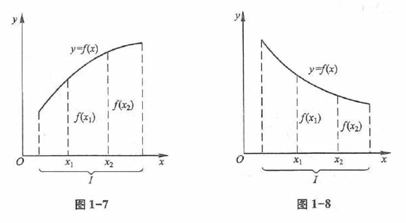

# 映射与函数

## 映射

### 定义 1

设 $X, Y$ 是两个非空集合，如果存在一个法则 $f$，使得对 $X$ 中每个元素 $x$，按法则 $f$，在 $Y$ 中有唯一确定的元素 $y$ 与之对应，
那么称 $f$ 为从 $X$ 到 $Y$ 的 ***映射*** ，记作  

$$
f: X \to Y
$$

其中 $y$ 称为元素 $x$（在映射 $f$ 下）的 ***像*** ，并记作 $f(x)$，即  

$$
y = f(x)
$$

而元素 $x$ 称为元素 $y$（在映射 $f$ 下）的一个 ***原像*** ； 
集合 $X$ 称为映射 $f$ 的定义域，记作 $D_f$ ，即 $D_f = X$ ； 
$X$ 中所有元素的像所组成的集合称为映射 $f$ 的值域，记作 $R_f$ 或 $f(X)$ ，即  

$$
R_f = f(X) = \{ f(x) \mid x \in X \}
$$

## 函数

### 定义 2

设数集 $D \subseteq \mathbf{R}$ ，则称映射 $f: D \rightarrow \mathbf{R}$ 为定义在 $D$ 上的 ***函数*** ，通常简记为

$$
y = f(x), \quad x \in D
$$

其中 $x$ 称为 ***自变量*** ，
$y$ 称为 ***因变量*** ，
$D$ 称为 ***定义域*** ，
记作 $D_f$，即 $D_f = D$ 。

> 函数的定义中，对每个 $x \in D$ ，按对应法则 $f$ ，总有唯一确定的值 $y$ 与之对应，
> 这个值称为函数 $f$ 在 $x$ 处的 ***函数值*** ，记作 $f(x)$ ，即 $y = f(x)$。
> 因变量 $y$ 与自变量 $x$ 之间的这种依赖关系，通常称为 ***函数关系*** 。
> 函数值 $f(x)$ 的全体所构成的集合称为函数 $f$ 的 ***值域***，记作 > $R_f$ 或 $f(D)$ ，即
> 
> $$
> R_f = f(D) = \{ y \mid y = f(x), x \in D \}
> $$

### 常用简单函数及其定义域

| 函数                                  | 定义域                                                                        |
| ------------------------------------- | ----------------------------------------------------------------------------- |
| $y = \frac{Q(x)}{P(x)}$               | $P(x) \not = 0$                                                               |
| $y = \sqrt[2n]{x}$                    | $x \ge 0$                                                                     |
| $y = \log_a x$                        | $x > 0$                                                                       |
| $y = \sin x$   $y = \cos x$       | $\mathbf{R}$                                                                  |
| $y = \arcsin x$   $y = \arccos x$ | $\vert x \vert < 1$                                                           |
| $y = \tan x$   $y = \sec x$       | $\{ x \in \mathbb{R} \mid x \neq k \pi + \frac{\pi}{2} , k \in \mathbb{Z} \}$ |
| $y = \cot x$   $y = \csc x$       | $\{ x \in \mathbb{R} \mid x \neq k \pi , k \in \mathbb{Z} \}$                 |

> - $\mathbb{Z}$ ：由全体整数构成的集合；
> - $\mathbb{R}$ ：由全体 [实数](https://baike.baidu.com/item/%E5%AE%9E%E6%95%B0/296419) 构成的集合；

### 函数的有界性

设函数 $f(x)$ 的定义域为 $D$，数集 $X \subseteq D$。

- 如果存在数 $K_1$，使得

  $$
  f(x) \leq K_1
  $$

  对任一 $x \in X$ 都成立，那么称函数 $f(x)$ 在 $X$ 上有 ***上界*** ，而 $K_1$ 称为函数 $f(x)$ 在 $X$ 上的一个上界。
  
- 如果存在数 $K_2$，使得

  $$
  f(x) \geq K_2
  $$

  对任一 $x \in X$ 都成立，那么称函数 $f(x)$ 在 $X$ 上有 ***下界*** ，而 $K_2$ 称为函数 $f(x)$ 在 $X$ 上的一个下界。
  
- 如果存在正数 $M$，使得

  $$
  |f(x)| \leq M
  $$

  对任一 $x \in X$ 都成立，那么称函数 $f(x)$ 在 $X$ 上 ***有界*** 。 
  如果这样的 $M$ 不存在，就称函数 $f(x)$ 在 $X$ 上 ***无界*** ； 
  这就是说，如果对于任何正数 $M$，总存在 $x_1 \in X$ ，使 $|f(x_1)| > M$ ，那么函数 $f(x)$ 在 $X$ 上无界。

### 函数的单调性

设函数 $y=f(x)$ 的定义域为 $D$，区间 $I \subseteq D$ 。

- 如果对于区间 $I$ 上任意两点 $x_1$ 及 $x_2$，当 $x_1 < x_2$ 时，恒有

  $$
  f(x_1) < f(x_2)
  $$

  那么称函数 $y=f(x)$ 在区间 $I$ 上是 ***单调增加的*** (图 1-7)；
  
- 如果对于区间 $I$ 上任意两点 $x_1$ 及 $x_2$，当 $x_1 < x_2$ 时，恒有

  $$
  f(x_1) > f(x_2)
  $$

  那么称函数 $y=f(x)$ 在区间 $I$ 上是 ***单调减少的*** (图 1-8)。
  
单调增加和单调减少的函数统称为 ***单调函数*** 。

### 函数的奇偶性

设函数 $f(x)$ 的定义域 $D$ 关于原点对称。

- 如果对于任一 $x \in D$,

  $$
  f(-x) = f(x)
  $$

  恒成立, 那么称 $f(x)$ 为 ***偶函数*** 。
  
- 如果对于任一 $x \in D$,

  $$
  f(-x) = -f(x)
  $$

  恒成立, 那么称 $f(x)$ 为 ***奇函数*** 。

> 奇函数的函数图像是 **原点对称** 或 **中心对称** 的，
> 偶函数的函数图像是 **轴对称** 的。
> 
> 偶函数 × 偶函数 = 偶函数 
> 奇函数 × 奇函数 = 偶函数 
> 奇函数 × 偶函数 = 奇函数 
> 
> 简单地说就是，
> 具有相同奇偶性的函数的乘积为偶函数；
> 具有不同奇偶性的函数的乘积为奇函数。

### 函数的周期性

设函数 $f(x)$ 的定义域为 $D$。
如果存在一个正数 $l$ ，使得对于任一 $x \in D$ 有 $(x \pm l) \in D$ ，且

$$
f(x+l) = f(x)
$$

恒成立，那么称 $f(x)$ 为 ***周期函数*** ，
$l$ 称为 $f(x)$ 的 ***周期*** ，
通常我们说 **周期** 函数的周期是指 ***最小正周期*** 。

### 反函数

设函数 $f: D \rightarrow f(D)$ 是单射，则它存在逆映射 $f^{-1}: f(D) \rightarrow D$ ，称此映射 $f^{-1}$ 为函数 $f$ 的 ***反函数*** 。

按此定义，对每个 $y \in f(D)$ ，有唯一的 $x \in D$ ，使得 $f(x) = y$ ，于是有

$$
f^{-1}(y) = x
$$

这就是说，反函数 $f^{-1}$ 的对应法则是完全由函数 $f$ 的对应法则所确定的。

### 复合函数

复合函数是复合映射的一种特例，按照通常函数的记号，复合函数的概念可如下表述：

设函数 $y=f(u)$ 的定义域为 $D_f$ ，函数 $u=g(x)$ 的定义域为 $D_g$ ，且其值域 $R_g \subseteq D_f$ ，则由下式确定的函数

$$
y = f[g(x)], \quad x \in D_g
$$

称为由函数 $u=g(x)$ 与函数 $y=f(u)$ 构成的 ***复合函数*** ，它的定义域为 $D_g$ ，变量 $u$ 称为 ***中间变量*** 。

### 函数的运算

设函数 $f(x), g(x)$ 的定义域依次为 $D_f, D_g, D = D_f \cap D_g \neq \varnothing$ ，则我们可以定义这两个函数的下列运算：

- 和（差）$f \pm g$ ：

  $$
  (f \pm g)(x) = f(x) \pm g(x), x \in D
  $$

- 积 $f \cdot g$ ：

  $$
  (f \cdot g)(x) = f(x) \cdot g(x), x \in D
  $$

- 商 $\frac{f}{g}$ ：

  $$
  \left( \frac{f}{g} \right)(x) = \frac{f(x)}{g(x)}, x \in D \setminus \{ x | g(x) = 0, x \in D \}
  $$

### 初等函数

### 初等数学中的几类函数

在初等数学中已经讲过下面几类函数：

- 幂函数：$y = x^{\mu}$ ($\mu \in \mathbf{R}$ 是常数)
- 指数函数：$y = a^{x}$ ($a > 0$ 且 $a \neq 1$)
- 对数函数：$y = \log_{a} x$ ($a > 0$ 且 $a \neq 1$，特别当 $a = \mathrm{e}$ 时，记为 $y = \ln x$)
- 三角函数：如 $y = \sin x$，$y = \cos x$，$y = \tan x$ 等
- 反三角函数：如 $y = \arcsin x$，$y = \arccos x$，$y = \arctan x$ 等

以上五类函数统称为 ***基本初等函数*** 。

由常数和基本初等函数经过有限次的四则运算和有限次的函数复合步骤所构成并可用一个式子表示的函数，称为 ***初等函数*** 。
例如：

- $y = \sqrt{1 - x^2}$
- $y = \sin^2 x$
- $y = \sqrt{\cot \frac{x}{2}}$

等都是初等函数。
本课程中所讨论的函数绝大多数是初等函数。

