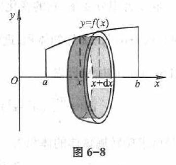

# 定积分在几何学上的应用

## 平面图形面积

### 直角坐标系情形

在 [定积分](../02-定积分/01-定积分的概念与性质.md) 中已经知道，由曲线
$y = f(x) \; (f(x) \geq 0)$ 及直线
$x=a, x=b \; (a < b)$ 与 $x$ 轴所围成的曲边梯形的面积 $A$ 是定积分

$$
A = \int_{a}^{b} f(x) \, \mathrm{d} x
$$

其中被积表达式 $f(x) \, \mathrm{d} x$ 就是直角坐标下的面积元素，它表示高为 $f(x)$ 底为 $\mathrm{d} x$ 的一小矩形面积。

应用定积分，不但可以计算曲边梯形面积，还可以计算一些比较复杂的平面图形的面积。

### 极坐标情形

// TODO: 不考

## 体积

### 旋转体的体积

***旋转体*** 就是由一个平面图形绕该平面内一条直线旋转一周而成的立体。
这直线叫做 ***旋转轴*** 。
圆柱、圆锥、圆台、球可以分别看成是由矩形绕它的一条边、直角三角形绕它的直角边、直角梯形绕它的直角腰、半圆绕它的直径旋转一周而成的立体，所以它们都是旋转体。

上述旋转体都可以看作是由连续曲线 $y=f(x)$，直线 $x=a, x=b$ 及 $x$ 轴所围成的曲边梯形绕 $x$ 轴旋转一周而成的立体。
现在我们考虑用定积分来计算这种旋转体的体积。

取横坐标 $x$ 为积分变量，它的变化区间为 $[a,b]$ 。
相应于 $[a,b]$ 上的任一小区间 $[x,x+dx]$ 的窄曲边梯形绕 $x$ 轴旋转而成的薄片的体积近似于以 $f(x)$ 为底半径、 $dx$ 为高的扇圆柱体的体积（图 6-8），即体积元素

$$
\mathrm{d} V = \pi [f(x)]^2  \mathrm{d} x
$$

以 $\pi [f(x)]^2 \mathrm{d} x$ 为被积表达式，在闭区间 $[a, b]$ 上作定积分，便得所求旋转体体积为

$$
V = \int_a^b \pi [f(x)]^2 \mathrm{d} x
$$

### 平行截面面积为已知的立体的体积

// TODO: 不考

## 平面曲线弧长

// TODO: 不考
